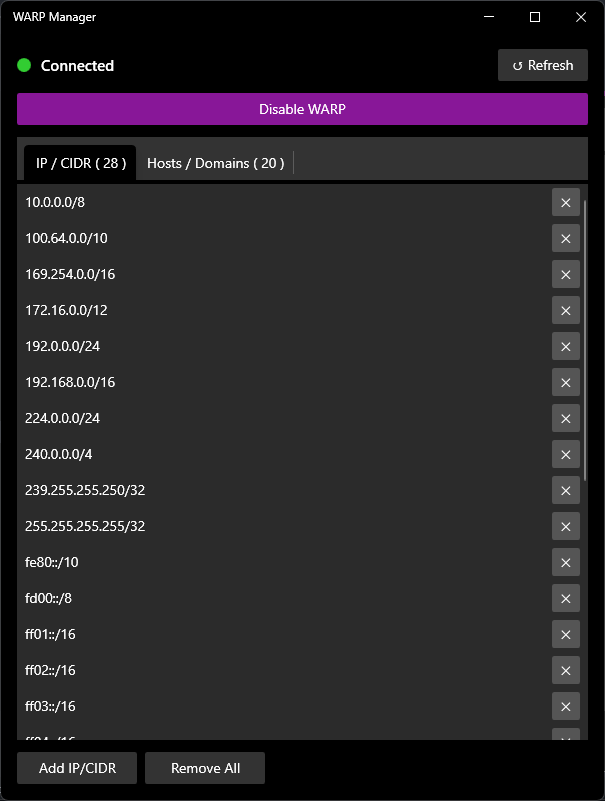

# WARP Manager

A minimal WPF desktop app for managing [Cloudflare WARP](https://1.1.1.1/) split-tunnel exclusions on Windows.
Latest version of Cloudeflare WARP(Cloudeflare One Client) does not support adding/removind ip/host with UI settings but it still can be done by warp-cli.



## Features

- Connect / disconnect WARP with one click
- Live status indicator (Connected / Connecting / Disconnected)
- View, add, and remove IP/CIDR and host/domain exclusions
- Auto-refresh every 30 seconds

## Requirements

- Windows 10/11
- [Cloudflare WARP](https://1.1.1.1/) installed at its default path:  
  `C:\Program Files\Cloudflare\Cloudflare WARP\warp-cli.exe`
- .NET 8 SDK (build only; the published exe is self-contained)

## Build & Run

```powershell
# Run from source
dotnet run --project WarpManager.csproj

# Publish a self-contained exe
dotnet publish -c Release -r win-x64 --self-contained \
    -p:PublishSingleFile=true \
    -p:IncludeNativeLibrariesForSelfExtract=true \
    -o ./dist
```

## Tech Stack

| | |
|---|---|
| UI framework | WPF / .NET 8 |
| Styling | [ModernWpfUI](https://github.com/Kinnara/ModernWpf) 0.9 |
| MVVM | [CommunityToolkit.Mvvm](https://github.com/CommunityToolkit/dotnet) 8 |
| DI | Microsoft.Extensions.DependencyInjection 8 |

## Architecture

MVVM throughout — no business logic in code-behind. All WARP operations go through `WarpCliService`, which shells out to `warp-cli.exe` with a 10-second timeout per call.

```
App.xaml.cs          — DI wiring (singleton: service, VM, window)
Services/            — IWarpCliService / WarpCliService (CLI adapter)
ViewModels/          — MainViewModel, ExclusionItemViewModel
Views/               — MainWindow, AddExclusionDialog
Models/              — WarpResult, ExclusionType
Converters/          — StatusToBrushConverter, BoolToVisibilityConverter
```


## Disclaimer

This project is an unofficial third-party tool and is not affiliated with, endorsed by,
or sponsored by Cloudflare, Inc. Cloudflare and Cloudflare WARP are trademarks of
Cloudflare, Inc. All product names, logos, and brands are property of their respective owners.

## License

MIT License

Copyright (c) [2026] [WARP Manager]

Permission is hereby granted, free of charge, to any person obtaining a copy
of this software and associated documentation files (the "Software"), to deal
in the Software without restriction, including without limitation the rights
to use, copy, modify, merge, publish, distribute, sublicense, and/or sell
copies of the Software, and to permit persons to whom the Software is
furnished to do so, subject to the following conditions:

The above copyright notice and this permission notice shall be included in all
copies or substantial portions of the Software.

THE SOFTWARE IS PROVIDED "AS IS", WITHOUT WARRANTY OF ANY KIND, EXPRESS OR
IMPLIED, INCLUDING BUT NOT LIMITED TO THE WARRANTIES OF MERCHANTABILITY,
FITNESS FOR A PARTICULAR PURPOSE AND NONINFRINGEMENT. IN NO EVENT SHALL THE
AUTHORS OR COPYRIGHT HOLDERS BE LIABLE FOR ANY CLAIM, DAMAGES OR OTHER
LIABILITY, WHETHER IN AN ACTION OF CONTRACT, TORT OR OTHERWISE, ARISING FROM,
OUT OF OR IN CONNECTION WITH THE SOFTWARE OR THE USE OR OTHER DEALINGS IN THE
SOFTWARE.